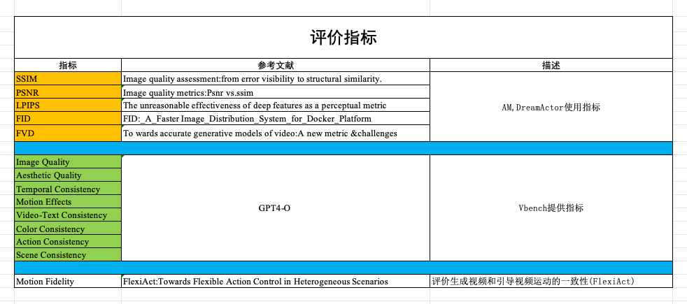

# 🎞 视频质量评估工具

本工具用于评估生成视频的质量，目前支持以下指标：

- **FID**（Fréchet Inception Distance）
- **PSNR**（Peak Signal-to-Noise Ratio）
- **LPIPS**（Learned Perceptual Image Patch Similarity）
- **FVD**（Fréchet Video Distance）
- **SSIM**（Structural Similarity Index Measure）



---

## 📌 使用方法

### 🧩 Step 1：推理生成视频

进入 `wan2.1basecode` 目录后，运行以下命令：

```bash
torchrun --nproc-per-node=2 VideoX-Fun/examples/wan2.1_fun/predict_i2v_benchmark.py
```

#### 参数说明：

- `--nproc-per-node`：使用的 GPU 数量。例如设置为 `8` 表示并行使用 8 个 GPU。
- `ulysses_degree` (第49行)：在 `predict_i2v_benchmark.py` 中同步设置为所用 GPU 数量。
- `model_name`（第 80 行）：指定模型路径，**建议使用绝对路径**，训练好的模型需要放置在指定的模型路径中，替换原有的 `diffusion_pytorch_model.safetensor` 文件。
- `save_path`（第 140 行）：指定生成视频的保存目录。

---

### 📊 Step 2：对生成结果进行评估

在生成视频后运行以下命令：

```bash
python VideoX-Fun/eval_benchmark.py --root_predict ./VideoX-Fun/samples/wan-videos-fun-i2v/ --root_benchmark ./VideoX-Fun/benchmark/videos/
```

#### 参数说明：

- `--root_predict`：生成的视频的根目录，默认为 `./VideoX-Fun/samples/wan-videos-fun-i2v/`
- `--root_benchmark`：benchmark 视频所在目录，默认为 `./VideoX-Fun/benchmark/videos/`
- 评估结果将被保存为 `eval_result.json`，全部视频的统计指标会被打印到控制台。
- **评估fvd和lipips需要用到预训练模型，模型文件已经被lfs进行了管理. 评估前需要将文件拉取到本地**

---

如有问题，联系xiatao@bit.edu.cn
